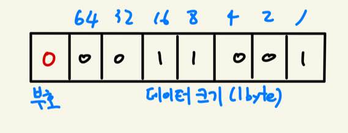
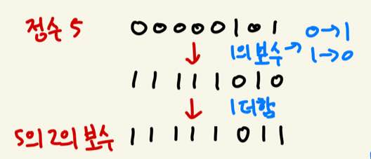
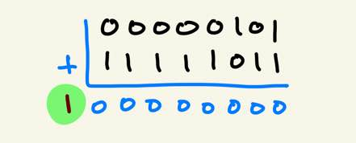

# 02-1 변수의 이해와 활용

- 변수란?

> 데이터의 저장과 참조를 위해 `할당된 메모리 공간`에 붙인 `이름`

- 변수는 메모리 공간 활용을 위한 도구이자, 그 메모리 공간의 할당과 접근을 위해 필요한 도구이다.
  - 변수를 선언한다는 것은 곧 메모리 공간의 할당으로 이어진다.
  - 그리고 그 할당된 공간에 이름이 붙는데, 이 이름을 통해 해당 메모리 공간에 접근할 수 있게 된다.

- 변수를 선언하면서 동시에 값을 저장할 수 있다. 
  - 변수에 처음 값을 지정하는 것을 `초기화`라고 한다.
- 용도에 맞게 값을 저장하자.
  - 정수 저장 용도로 변수를 선언했다면, 정수를 저장해야 한다. 실수를 저장하는 경우 오류가 발생한다.

- 자료형
  - 변수에 저장할 데이터의 유형을 알리는 키워드

| 자료형  | 데이터    | 크기    | 표현 가능 범위                                         |
| ------- | --------- | ------- | ------------------------------------------------------ |
| boolean | 참 / 거짓 | 1바이트 | true, false                                            |
| char    | 문자      | 2바이트 | 유니코드 문자                                          |
| byte    | 정수      | 1바이트 | -128 ~ 127                                             |
| short   | 정수      | 2바이트 | -32,768 ~ 32.767                                       |
| int     | 정수      | 4바이트 | -2,147,483,648 ~ 2,147,483,647                         |
| long    | 정수      | 8바이트 | -9,223,372,036,854,775,808 ~ 9,223,372,036,854,775,807 |
| float   | 실수      | 4바이트 | ± (1.40 * 10^-45 ~ 3.40 * 10^38)                       |
| double  | 실수      | 8바이트 | ± (4.94 * 10^-324 ~ 1.79 * 10^308)                     |

- 이런 자료형을 기본(원시) 자료형이라 하는데, 종류에 따라서 다시 아래처럼 구분이 가능하다.

| 정수 표현      | byte, short, int, long |
| -------------- | ---------------------- |
| 실수 표현      | float, double          |
| 문자 표현      | char                   |
| 참 / 거짓 표현 | boolean                |

- 표현, 저장하려는 값 범위에 따라 적절한 자료형을 선택하자. 바이트 크기가 클수록 표현할 수 있는 값의 범위는 넓어진다.
- 변수 이름 짓기
  - 자바는 대소문자를 구분한다.
  - 변수의 이름은 숫자로 시작할 수 없다.
  - `$`, `_`를 제외한 특수문자는 변수명으로 사용할 수 없다.
  - 키워드 역시 사용 불가하다.


# 02-2 정수의 표현 방식

> 몇 바이트로 정수를 표현할 것인가?

- 바이트 크기가 클수록 표현 가능한 정수의 범위는 넓어진다. 하지만 값을 표현하는 기본 원리는 동일하다.



- 가장 왼쪽 비트가 0이면 양수, 1이면 음수를 의미
  - 이 비트가 0일 때, 나머지 일곱 비트는 데이터의 양적인 크기를 의미
  - 이 비트는 양수 25를 의미

- 그렇다면 음의 정수는?
  - 부호 비트가 1이면 음의 정수
  - 이 때도 나머지는 데이터의 양적 크기일까?
  - 그러면 00000001 과 10000001을 더하면 0이 되는건가?
  - 절대 그렇게 안 된다
- 그러면 음의 정수는?
  - 양의 정수의 2진수 표현에 2의 보수를 취한 결과를 음의 정수로 표현한다.

- 2의 보수를 어떻게 구하는가?
  - 우선 1의 보수를 구해야 한다. 1의 보수는 각 비트가 0이면 1로, 1이면 0으로 변환해 얻어진다.
  - 그 후 1을 더한 것이 2의 보수이다. 양의 정수 5의 2의 보수를 구하는 과정은 아래와 같다.



- 그러면 양수와 2의 보수를 더하면 어떻게 되는가?

  - 컴퓨터는 n바이트 덧셈 연산을 할 때 결과 역시 n바이트로 반환한다.
  - 따로 올림되는 수에 대한 처리를 하지 않는다면 올림 수는 버려진다.
  - 아래의 그림에서 볼 수 있듯 덧셈 연산의 결과는 0이 된다.

  


# 02-3 실수의 표현 방식

- 기본적으로 컴퓨터의 실수 표현에는 오차가 존재한다.
  - 만약 실수형 변수를 선언하고 값을 0.01로 초기화한다면, 이 값은 문자 그대로의 0.01이 아니다.
  - 0.01에 가까운 값일 뿐 정확한 0.01이 아닌 것이다. 
  - 0.01과 0.02사이에 몇 개의 실수가 존재하겠는가? 우리는 그 답을 알 수 없다.
- 그렇기에 **정밀도를 낮추고** **근사치의 값을 찾아** 표현하게 된다.
  - 어떻게 정밀도를 낮추고 표현할 수 있는 값의 범위를 넓힐 수 있을까?
  - `IEEE 754`표준을 통해 이를 찾을 수 있는데, 지수로 표현된 식을 통해 근사치의 값을 표현할 수 있다.
  - 이렇게 표현 가능한 값의 범위는 넓어졌지만 그로 인해 대부분의 값에는 오차가 존재하게 된다.


# 02-4 기본 자료형

- 변수를 선언할 때 자료형을 결정하는데, 이것은 해당 변수에 값을 저장하고 참조하는 방식을 결정하는 것
- 정수 자료형(`byte`, `short`, `int`, `long`)
  - 정수 자료형으로 선언된 변수에는 실수를 저장할 수 없다.
  - 각 정수 자료형이 갖는 차이는 정수 표현에 사용하는 메모리 공간의 크기이다.
  - 만약 int로 선언한다면, 4바이트 크기의 변수가 만들어지는 것이다.
- 둘 중에 하나만 골라 short or int

```java
int main(String[] args) {
    short/int num1 = 11;
    short/int num2 = 22;
    short result;
    result = num1 + num2;
}
```

- short과 int 중 어떤 자료형을 사용해야 할까?
  - 초기화된 숫자값이 2바이트 정수로 표현 가능하니 short를 써야 할까?
  - 그렇다면..

```java
class promotion {
    public static void main(String[] args) {
        short num1 = 11;
        short num2 = 22;
        short result = num1 + num2;
        System.out.println(result);
    }
}
```

- 이렇게 코드를 작성하고 실행하면 어떻게 될까? 당연히 컴파일 에러가 발생한다. 
- 왜냐하면 자바는 정수형 연산을 **int**로 진행하기 때문이다. 
  - byte나 short형 변수에 저장된 값을 대상으로 연산을 진행하면 이들을 int형 값으로 변환해버린다.
  - 이런 연산 결과는 int형인데 이를 담을 변수 result는 short형이기 때문에 문제가 발생한다.
  - int로 선언하자.
  - 그렇다고 byte나 short가 쓸데없다는건 아니다.
  - 참고로 long에서 int로는 변환되지 않는다. long에서 int로 변환을 하면 데이터의 손실이 생겨버린다.
- 실수 자료형(`float`, `double`)
  - 얘들은 정밀도를 포기하고 근사치를 통해 표현의 범위를 넓힌 자료형이다.
  - 그러므로 선택 기준은 값의 표현 범위가 아닌 정밀도이다.
  - 표현하는 바이트 수가 크면 오차의 크기가 작아진다. -> 오차: float > double
- 문자 자료형(`char`)
  - 하드웨어는 수를 인식하고 표현한다. 그렇기에 문자 표현은 하드웨어상의 SW가 하게 된다.
  - 어떻게 해야 하나? HW가 수밖에 인식을 못 하니 문자마다 숫자를 부여해야 한다.
  - 이러한 문자 표현의 약속을 `문자 셋`이라고 하는데, 세계적으로 사용할 수 있는 셋을 `유니코드`라 한다.
  - 유니코드는 문자 하나를 2바이트로 표현하는 체계이다.
  - 2바이트는 총 2^16, 6만개 이상의 문자 표현이 가능하다. 
  - 문자 자료형 `char` 변수 하나에 한글 문자 하나를 저장하는 것이 가능해진다.
  - 작은 따옴표로 묶어 하나의 문자를 표시하는데, 문자의 저장은 유니코드 값의 저장으로 이어진다.
  - 다시 정리해 말하자면 자바 프로그램 내에서 문자는 작은 따옴표로 묶어서 표현하는데, 문자를 `char`형 변수에 저장할 때 실제 저장되는 것은 해당 문자의 유니코드 값이다라는 것이다.
- 논리 자료형(`boolean`)
  - 참과 거짓의 표현을 목적으로 하는 자료형 (true / false)
  - boolean형 변수를 선언하고 그 변수에 true나 false를 저장할 수 있다. 