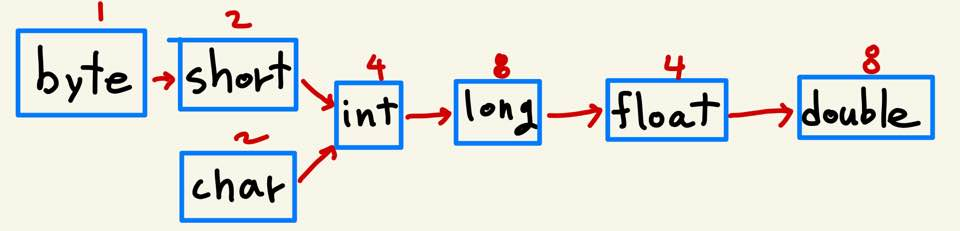

# 03-1 상수

> 값이 변하지 않는 수

- 하지만 자바에서는 한번 그 값이 정해지면 이후로는 변경이 불가능한 변수도 상수라고 한다
- 변수를 선언할 때 그 안에 `final`이라는 선언을 추가하면 그 변수는 `상수`가 된다.
  - 값을 딱 한번만 할당할 수 있음
  - 한번 할당된 값은 변경이 불가능하다
  - 상수를 선언만 하고 값을 할당하지 않으면 한 번은 값을 할당할 수 있다.  그 이후로는 값의 변경이 불가능하다.
  - 관례상 상수의 이름은 전부 대문자로 짓고, 둘 이상의 단어일 때는 언더바로 단어를 연결한다.
  - 변수에 상수의 성격을 부여한다고 생각하자

```java
class Constants {
    public static void main(String[] args) {
        final int MAX_SIZE = 100;
        final char CONST_CHAR = '상';
        final int CONST_ASSIGNED;
        CONST_ASSIGNED = 10;
        System.out.println("상수1 : " + MAX_SIZE);
        System.out.println("상수2 : " + CONST_CHAR);
        System.out.println("상수3 : " + CONST_ASSIGNED);
    }
}
```

- 리터럴
  - `int num = 157;` 이 문장은 변수를 선언과 동시에 157이라는 값으로 초기화한 것이다.
  - 여기서 대입 연산자 오른편의 157을 리터럴, 혹은 리터럴 상수라고 한다.
  - 컴파일러는 숫자 157을 `int`형 정수로 인식한다.
  - 정수 표현 방법에는 4가지, 실수 표현 방법으로는 2가지가 있다. 이렇기에 숫자를 접했을 때 이 숫자를 **무엇으로 인식하느냐**에 대한 **약속**이 필요한데, 이 약속에 근거해 표현된 숫자를 리터럴, 또는 리터럴 상수라고 한다. 
  - 위의 문장을 다시 확인해보자
  - **int** num = 157; 여기서 변수 num이 int형이라 int형 정수로 나타나는 것은 아닐까?
  - 그러면 이건 어떨까?
  - `long num = 3147483647;` 
  - 이걸 컴파일하면 `integer number too large`라는 오류를 만날 수 있다. 왜일까? 분명 long형으로 선언한거같은데? integer number가 크다고?
  - 변수 왼편의 자료형에 관계없이 정수는 int형으로 표현하기로 약속되어 있다.
  
- 정수형 상수의 표현 방법
  - 그냥 정수를 쓰면 int형으로 인식되는데, 이런 정수는 8진수, 10진수, 16진수로 표현 가능하다.
  - `int num = 11 + 22 + 33;` // 10진수
  - `int num = 011 + 022 + 033;` // 8진수 - 숫자 앞에 `0`을 삽입
  - `int num = 0x11 + 0x22 + 0x33;` //16진수 - 숫자 앞에 `0x` 또는 `0X` 삽입
  - `byte seven = 0B111;` // 2진수 - 숫자 앞에 `0B`삽입
  - 자바는 `byte`형이나 `short`형 정수의 표현 방법을 제공하지 않는다.
  - 그렇기에 `byte num1 = 5;` 나 `short num2 = 8;`과 같은 초기화가 허용된다.
  - 물론 여기서도 각 자료형의 표현 범위를 넘어가는 수로 초기화하려는 경우 오류가 발생한다.
  - `long`형은 조금 이야기가 다른데, 컴파일러가 알아서 `long`형을 인식하지 않는다.
  - 숫자의 끝에 `l`이나 `L`을 붙여야만 `long`형 정수로 표현할 수 있다.
  - `System.out.println(3147483647L + 3147483648L)` // 이렇게 쓰자!
  
- 실수형 상수의 표현 방법
  - 정수형 상수가 `int`형으로 인식되듯 실수형 상수는 기본적으로 `double`형으로 인식된다.
  - 실수가 `double형`으로 표현된 상수임을 명시하려면, `long`형때처럼 별도 처리가 필요하다.
  - `System.out.println(3.0004999D + 2.0004999D);` // `D`를 붙이자
  - `float`형 실수를 표현하려면..
  - `System.out.println(3.0004999f + 2.0004999f);` // `f` / `F` 를 붙이자!
  - 지수로도 실수를 표현할 수 있다.
  - `3.4e3`은 `3.4 * 10^3`과 같고, 이는 `3400.0`을 의미한다.
  - 지수를 활용한 방법으로 `3.4e-3f`처럼 `float`형 실수를 표현할 수 있다.
  - `0.5`를 `.5`로, `5.0`을 `5.`으로 바꿀 수 있는데, 이렇게 특수한 상황에서 붙은 숫자 0을 생략할 수 있다. 
  
- 부울형 / 문자형 상수

  - boolean형이 가지는 값은 `true` / `false` 2가지이다.
  - 문자형 상수의 표현 방법은 문자에 작은 따옴표를 씌우는 것이다. `'김치'`
  - 이스케이프 시퀀스는 유니코드 중 키보드로 입력하기 어려운 문자 표현을 위한 것이다.

  - `\b`: 백스페이스
  - `\t`: 탭 
  - `\\`: 백슬래시
  - `\'`: 작은 따옴표
  - `\"`: 큰 따옴표
  - `\n`: 개행
  - `\r`: 캐리지 리턴 문자
  - 캐리지 리턴은 그 형태가 조금 독특한데, 커서를 왼쪽 끝으로 이동시킨다.
  - 아래의 코드로 예시를 들면, `\b`의 경우 백스페이스 문자이고, AB에서 B가 지워진 뒤 AC 출력
  - `\r`의 경우 커서를 왼쪽 끝으로 이동시킨 후 문자 C가 출력되어 기존의 문자 A가 지워진다.
  - 유로화 표시를 유니코드를 이용해 할 수 있는데, `\u`를 이용한 형태로 가능하다.

```java
class EscapeSequences {
    public static void main(String[] args) {
        System.out.println("AB" + '\b' + 'C'); // AC
        System.out.println("AB" + '\r' + 'C'); // CB
        System.out.println("오늘의 환율은 1$에 0.88" + '\u20AC' + "입니다.");
    }
}
```

# 03-2 형 변환

> 자바는 1.0과 1을 동일하다고 생각할까?

- 결론부터 얘기하면 1.0과 1 두 값을 표현하고 저장하는 방식이 다르기에 자바는 둘을 다르게 본다.

```java
System.out.println(num1 + num2)
```

- 이런 문장이 있다면, 자바는 두 변수의 자료형이 같을 것을 기대한다.
  - 자료형이 다른 두 값을 대상으로는 덧셈을 하지 못하기 때문!

```java
int num1 = 50;
long num2 = 3147483647L;
System.out.println(num1 + num2) // 두 변수간 자료형이 다르다!
```

- 위의 상황이라면 int형 변수 num1의 값을 long형으로 변환해야 데이터의 손실이 없다.
  - 그러므로 num1에 저장된 값을 long형으로 바꾸어 메모리에 임시 저장한다.
  - 그 후 변환된 값과 num2의 값을 대상으로 덧셈을 진행한다.
- 이러한 일련의 과정을 형 변환이라고 한다!
- 자동 형 변환
  - 앞서 본 예시를 `자동 형 변환`이라 한다. 별도로 명시한 것이 아닌, 자동으로 일어난 변환
  - 이러한 자동 형 변환은 두 가지의 규칙에 근거한다.
    - 자료형의 크기가 큰 방향으로 형 변환이 일어난다.
    - 자료형의 크기에 무관하게 정수보다 실수 자료형이 우선된다.
    - 아래의 그림에서 알 수 있는 것은 int형 데이터는 필요시 long, float, double형 데이터로 자동 형 변환이 가능하고, 모든 데이터를 필요시 double형 데이터로 변환할수 있다.
    - 이를테면, `double num1 = 30;`에서 int형 정수 30이 double형으로 자동 형변환되고, `System.out.println(59L + 34.5)`에서 long형 데이터 59L이 double형으로 자동 형 변환되는 것을 볼 수 있다. 
  - 왜 실수형이 크기에 무관하게 정수형보다 우선되는 것일까?
    - 정수형에 비해 실수형이 값의 표현 범위가 더 넓기 때문이다. 
    - 표현할 수 있는 범위가 정수에 비해 넓기에, 정수형 데이터를 실수형으로 변환해도 데이터의 손실이 없다는 것을 알 수 있다. 물론 실수형 데이터인 이상 원본 정수형 데이터와 비교해 어느 정도의 오차는 발생하게 된다.



- 명시적 형 변환	

  - 자동 형 변환이 안되는 상황에서도 필요에 따라 `명시적`으로 자료형을 변환할 수 있다.
  - `double pi = 3.1415;` `int wholenumber = (int)pi;`
  - 위의 문장에서 double형 변수 pi의 값을 int형으로 변환했다. 자료형의 크기가 큰 방향으로, 실수형이 우선한다는 규칙에는 어긋나지만 변환은 이루어진다.
  - 실수형 데이터를 정수형으로 변환할 때 소수점 이하의 값은 잘려나간다.
  - 따라서 위의 예시에 따르자면 int형 변수 wholenumber에 저장되는 값은 정수 3이 된다.
  - 명시적으로 형 변환을 하는 경우 주의할 부분이 있다.
  - `long num1 = 3000000007L;` `int num2 = (int)num1`;
  - 위의 경우 long에서 int로의 명시적 형 변환을 하는 과정인데, 큰 정수 자료형에서 보다 더 작은 정수 자료형으로 형 변환을 진행하는 경우 크기 차이만큼의 상위 바이트가 잘려나간다.
  - 즉, long형 변수인 num1의 상위 4바이트가 잘린 나머지만 int형 변수인 num2에 저장된다.

  - 만약 잘려나간 4바이트가 비어있지 않고 어떠한 유효한 값을 담고 있었다면, 본래 저장되었던 값이 아닌 알 수 없는 값이 되어버리기 때문에 각별한 주의가 필요하다.
  - `short num1 = 1;` `short num2 = 2;` `short num3 = num1 + num2;`
  - 위의 문장은 에러를 발생시킨다. 왜일까?
  - 덧셈 연산을 위해 num1과 num2에 저장된 값이 int형으로 변환되어 메모리에 임시 저장된다.
  - 그 후 덧셈연산을 하는데, 그 결과는 int형이다. 변수 num3은 short형이기에 문제가 생긴다.

  - 그러면 어떻게 하지?
  - `short num3 = (short)(num1 + num2)` 
  - 형 변환을 목적으로 하는 소괄호를 따로 작성해주어야 한다.