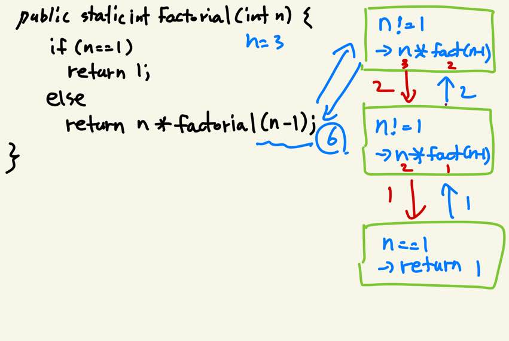

# 06-1 메소드에 대한 이해와 메소드의 정의

> 시작도 main, 종료도 main!

- 여태까지 main이라는 이름의 메소드 안에 실행할 내용을 담았다.

```java
public static void main(String[] args) {
    int num1 = 5;
    int num2 = 7;
    System.out.println("5 + 7 = " + (num1 + num2));
}
```

- 여기서 알 수 있었던 것은?

  - 메소드의 이름이 main이다.
  - 메소드의 중괄호 내에 존재하는 문장들이 위에서부터 순차적으로 실행된다.

- 아직 알 수 없었던 것은?

  - public, static, void는 대체 뭐야?
  - 왜 이름은 main이지?
  - 메소드 오른쪽 소괄호 안에 있는건 또 뭘까?

  

- 자바 프로그램은 main이라는 이름의 메소드로부터 시작한다!!

  - main 메소드가 실행되는 순간이 프로그램의 시작이고, 끝나는 순간이 프로그램의 종료 시점이다.
  - 따라서 main 메소드 안에 추가로 정의하는 메소드의 이름은 직접 결정할 수 있다.
  - 메소드의 실행을 명령하는 문장을 **메소드 호출문**이라고 한다.
  - 아래의 경우에는 10이라는 값을 전달하며 메소드 hi의 호출을 명령하는 것이다.
  - 메소드 호출 시 전달되는 값을 받기 위해 선언된 변수를 **매개변수**라고 한다.
    - 매개변수는 메소드 호출시 선언되어 전달되는 값을 저장한다.
    - 매개변수가 선언된 **메소드 안에서만 유효한 변수**이다.
  - 정의된 메소드는 여러 번 호출이 가능하다!
    - 메소드의 정의 위치는 프로그램에 영향이 없다.
  - 매개변수가 두 개이거나, 없을 수도 있다.

```java
public static void main(String[] args) {
    System.out.println("시작");
    hi(10); // 박수 10번     <- 메소드 호출문
    hi(15); // 박수 15번
    System.out.println("끝");
}

public static void hi(int count) {
    System.out.println("박수 "+ count + "번");
}

public static void check(int name, double pi) {
    System.out.println(name + " times");
    System.out.println("pi is " + pi);
}

public static void hi(int count) {
    System.out.println("박수 "+ count + "번");
}
```

- 값을 반환하는 메소드
  - 메소드를 호출해 값을 전달할 수도 있지만, 메소드 내에서 메소드를 호출한 영역으로 값을 보낼 수 있다.
  - main 메소드 옆의 void의 의미는 **이 메소드는 값을 반환하지 않는다**라는 뜻이다!
  - 여태까지 정의한 모든 메소드들은 값을 반환하는 형태가 아니었기에 void를 계속 써온 것
  - 메소드의 이름 왼편에 자료형이 위치하는데, 이는 **oo 메소드는 oo 형 값을 반환한다** 라는 의미이다.

```java
public class methodReturn {

	public static void main(String[] args) {

		int result;
		result = adder(4, 5); // adder 메소드를 수행한 후 -> result = 9;
		System.out.println("4 + 5 = " + result);
		System.out.println("3.14 * 3.14 = " + pipi(3.14)); // -> 9.8596
	}
	
	public static int adder(int num1, int num2) {
		int addNum = num1 + num2;
		return addNum;
	}

	public static double pipi(double num3) {
		return num3 * num3;
	}
}
```

- 키워드 return이 가지는 의미들
  - return문이 실행되면 메소드가 종료되고 값이 반환된다. return이 가지는 의미는 두 가지이다.
    - 메소드를 호출한 영역으로 값을 반환
    - 메소드의 종료
  - 메소드 중간에서 return문이 실행되면 값이 반환되며 메소드의 실행이 종료된다!

```java
public class methodEnd {

	public static void main(String[] args) {

		divide(4, 1);
		divide(9, 0);
	}

	public static void divide(int num1, int num2) {
		if (num2 == 0) {
			System.out.println("0으로는 못 나눕니다.");
			return;   // 값 변환 없이 메소드 종료
		} 
		System.out.println("나눈 결과 : " + (num1 / num2));
	}
}
 
```


# 06-2 변수의 스코프

> 영역을 벗어나면 넌 아무것도 아니야

- 스코프란?
  - 임의의 변수에 대한 변수의 접근 가능 능력, 변수가 소멸되지 않고 존재할 능력을 의미
  - 중괄호로 영역을 감싸면, 해당 영역은 변수에 대한 별도의 스코프를 형성한다.

```java
if (조건) {
    int num1 = 3;   // 닫는 중괄호 안에서만 int형 변수 num1에 접근이 가능. 
}                   // 중괄호를 벗어나는 순간 소멸해 접근할 수 없게 된다.

public class localVariable {

	public static void main(String[] args) {

		boolean ste = true;
		int num1 = 11; // 여기서 num1을 선언했기에 main 메소드 안에서만 접근이 가능하다.
		if (ste) {
//			int num1 = 22;   여기서 주석을 풀면 오류가 난다. duplicate local variable
//                           왜? 위에서 이미 선언된 변수명을 추가로 선언할 수 없다.
			num1++;
			System.out.println(num1);
		}
		{
			int num2 = 33;
			num2++;
			System.out.println(num2);
		}
	}

}

```

- **지역변수는 선언된 지역을 벗어나면 메모리 공간에서 소멸된다!!!**


## 06-3 메소드의 재귀 호출

> 점점 깊어지는 재귀의 늪

- 재귀적 메소드의 정의

  - 아직 실행되지 않은 메소드를 어떻게 다시 호출할까?
  - 메모리 공간에 저장된 메소드의 바이트 코드가 부분적으로 복사되어 실행이 된다. 

  

```java
public class factorialRecur {

	public static void main(String[] args) {

		System.out.println("3 Factorial: " + factorial(3));
	}

	public static int factorial(int n) {
		if (n == 1)
			return 1;
		else
			return n * factorial(n - 1);
	}
}

```



- 잘못된 재귀
  - 종료 조건이 없는 경우 재귀가 무한으로 돌게 된다.
  - 아래의 경우, cnt == 1이 true가 되어 return을 통해 재귀를 종료시켜야 하는데, 바로 아래의 hi(cnt--)에서 cnt의 값이 전달되고 난 뒤 감소된다. 재귀가 도는 동안 값은 줄지 않는다.

```java
public class wrongRecur {

	public static void main(String[] args) {

		show(3);
	}
	
	public static void show(int cnt) {
		if (cnt == 1) 
			return;
		show(cnt--); // 이대로 돌리면 난리난다
	}

}
```

