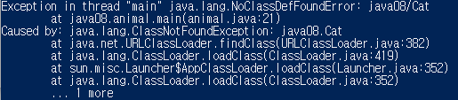

# 08-1 클래스 패스(Class Path)

> JVM이 클래스 파일을 찾는 경로를 지정해주자!

- 클래스 패스?

  - JVM이 클래스 파일을 찾는 경로!
  - 소스 파일을 만들어보자

  ```java
  // animal.java
  
  class Dog {
  	public void myName() {
  		System.out.println("Hello, dog");
  	}
  }
  
  class Cat {
  	public void myName() {
  		System.out.println("Hello, cat");
  	}
  }
  
  public class animal {
  
  	public static void main(String[] args) {
  		Dog poodle = new Dog();
  		poodle.myName();
  		
  		Cat persian = new Cat();
  		persian.myName();
  	}
  
  }
  ```

  - 이제 터미널에서 이 소스 파일을 컴파일하면... 

  ```bash
  C:...\src\java08> javac animal.java
  ```

  - animal, cat, dog 3개의 클래스에 대한 클래스 파일이 만들어진다!
  - 그러면 이제 실행해볼까?

  ```bash
  C:...\src\java08> java animal
  오류: 기본 클래스 animal을(를) 찾거나 로드할 수 없습니다.
  ```

  - 아니 이게 무슨 소리야!
    - 왜 안되는걸까? 
    - 원인은 java07/java08처럼 패키지를 생성해 분류한 것에 있었다.
    - 명령 프롬프트가 파일을 실행하게 하려면, `패키지명.클래스 파일명` 이렇게 주어야 한다!
  - 다시 제대로 해보자. 이제 제대로 실행될까?

  ```java
  PS C:...\src> java java08.animal
  Hello, dog
  Hello, cat
  ```

  - 클래스 패스를 따로 지정하지 않으면, JVM은 필요한 클래스를 **현재 작업중인 디렉터리 위치**에서 찾는다.
  - JVM은 현재 디렉터리인 src/ 안에서 필요한 클래스 파일을 모두 찾을 수 있기에, 실행에 문제가 없다.
  - 그런데 클래스 파일이 서로 다른 디렉터리에 있다면? Cat.class를 test1이라는 폴더 안에 넣어보았다.

  

  - 아니 이게 왜 오류가 나는걸까

    ```java
    Cat persian = new Cat(); // Cat.class의 저장 위치가 달라진 상태! JVM이 못 찾는다
    ```

    - JVM은 main 메서드를 실행하고, 그 안의 코드를 차례로 수행하다 Cat.class를 찾게 된다.
    - 물론 현재 작업중인 디렉터리에서 찾는데, Cat.class는 다른 디렉터리에 저장된 상황이다!

  - 그러면 이런 문제를 어떻게 해결할까?

    - **클래스 패스**를 지정해 Cat.class도 찾을 수 있게끔 JVM의 클래스 탐색 경로를 추가해주면 된다!


- 클래스 패스의 지정
  - 절대 경로, 또는 상대 경로
  - cmd에서 진행해보자
  
  ```shell
  C:\...\src> set classpath
  classpath 환경 변수가 정의되지 않았습니다.
  ```
  
  - 클래스 파일이 위치한 경로를 추가해주자!
    - ;을 통해 여러 경로를 지정해줄 수 있다.
  
  ```shell
  C:\...\src> set classpath=C:\...\src          절대경로
  C:\...\src> set classpath=.;.\java08          상대경로
  ```
  
  


# 08-2 패키지

> 직접 구현한 클래스보다는 어디에선가 가져오는 것이 더 많아서 생기는 이름 충돌 문제를 해결하는 방법은?

- 왜 하는걸까?
  - 기본으로 제공되는 클래스만 해도 수백 가지이고, 어디에선가 가져온다면 그 수는 더 많아진다
  - 이름만 가지고는 어떤 역할을 하는 클래스인지 알기 어렵고, 심지어 이름이 같을 수도 있다!
  - 주소 정보 등을 이용해 패키지의 이름을 지어줘 이름이 겹치는 문제를 해결할 수 있다.


- 어떻게 선언할까?

  - 클래스명과 구분되게끔 패키지명은 전부 소문자로
  - 도메인의 역순으로!
  - 패키지명의 끝에 팀의 이름을 붙인다.
  - www.naver.com의 lazy 팀이라면..
  - **com.naver.lazy**처럼 지어줄 수 있다!
  - 이러한 패키지 선언을 통해서 클래스를 구분할 기준을 만들 수 있고, 패키지의 각 클래스를 서로 다른 디렉터리에 저장될 수 있게 해 클래스의 접근 방법, 공간적인 측면에서의 문제를 해결했다!
  - 이제 클래스의 인스턴스를 생성하려면... 아래와 같이!

  ```java
  com.naver.lazy.Classname VariableName = new com.naver.lazy(value)
  ```

  - 이제 클래스 파일도 지정한 패키지의 위치에 저장되게 된다.


- 클래스를 패키지로 묶어주는 패키지 선언

  - 해당 클래스를 담는 소스파일의 상단에 패키지 선언을 해주자!

  ```java
  package com.naver.lazy;
  ```

  - com/naver/lazy 디렉터리를 직접 생성해서 클래스 파일을 넣어줘도 문제가 없지만

  ```shell
  C:\... >javac -d . ch08\square1\Square.java
  ```

  - 이렇게 해주면 패키지로 묶인 파일의 컴파일이 가능해진다!
  - 패키지 선언을 해준 디렉터리에 클래스 파일이 생성되는 것을 확인할 수 있다.


- 패키지로 묶여진 클래스의 접근

  ```java
  // SquareCalc.java
  
  com.square.lazy.Square s1 = new com.square.lazy.Square(4);
  ```

  - JVM은 패키지를 먼저 찾는데, 클래스 패스를 기준으로 com.square.lazy 패키지를 찾게 된다!
  - 클래스 패스가 지정되었다면, com이라는 디렉터리가 존재하는 디렉터리가 클래스 패스에 포함되어있어야 한다!
  - 지정되지 않았다면, 현재 디렉터리를 기준으로 패키지를 찾는다.


- import 선언

  - 동일한 이름의 클래스가 사용되지 않을 때, 패키지 이름을 생략하는 방법

  ```java
  // SquareImport.java
  
  import com.square.lazy.Square;
  ```

  - 해당 import문은 앞으로 Square는 com.square.lazy.Square와 같다는 것을 의미한다.

  - 물론 동일한 이름의 클래스에 대한 둘 이상의 import문은 컴파일 에러를 가져온다!(다른 디렉터리여도)

  - 주의할 점

    ```java
    import com.square.lazy.*;
    ```

    - 저렇게는 쓰지 말자! 이는 com.square.lazy 패키지 안의 클래스는 패키지 선언을 생략하겠다는 것을 의미하는데, 이름 충돌의 우려가 있다.
    - 패키지를 대상으로 하는 import문은 가급적 사용을 지양해야 하지만, 많이들 사용한다.

    
