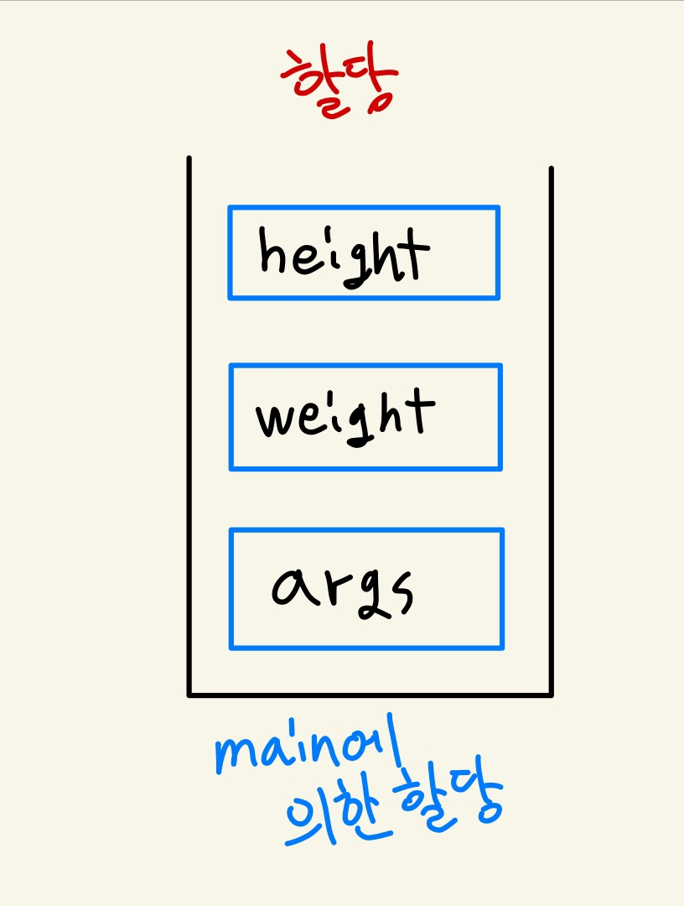
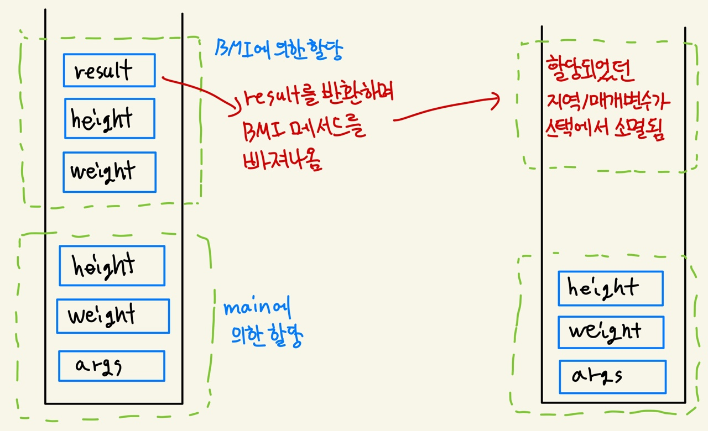
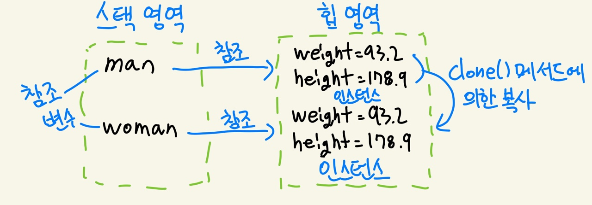
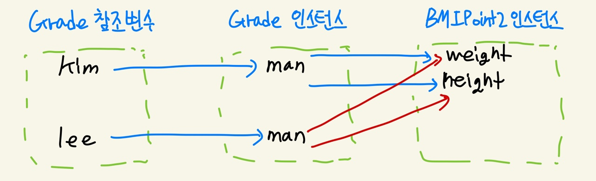
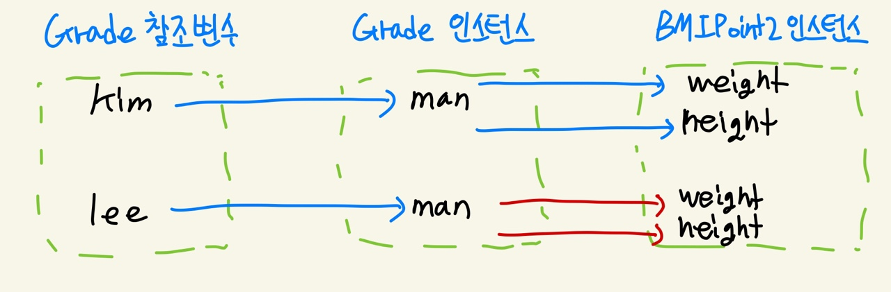

# 19-1 JVM의 메모리 모델

> 메서드 - 스택 - 힙

- 운영체제는 공평하다
  - JVM은 운영체제 위에서 동작한다. 그리고 자바 프로그램은 JVM 위에서 실행된다.
  - 운영체제는 JVM이라고 해서 특별히 하드웨어 자원을 더 많이 할당해주지 않는다!
  - 따라서 JVM은 주어진 자원을 효율적으로 사용하게 된다.


- 메모리 공간을 나눠보자 - 메서드, 스택, 힙

  - 메서드 영역

    - **메서드의 바이트 코드, static 변수**가 할당된다.
    - 바이트 코드: 소스 파일을 컴파일할 때 생성되며 JVM에 의해 실행이 가능한 코드
    - 바이트코드 역시 메모리 공간에 존재해야 실행이 가능하다!
    - **특정 클래스의 정보가 메모리 공간(메서드 영역)에 올려질 때 채워지는 영역**
    - 한 번 메서드 영역에 들어가면(할당되면) 프로그램 종료시까지 지우거나 꺼내지 않는다.
    - static 변수는 할당 및 초기화까지

  - 스택 영역

    - **지역변수, 매개변수가 할당되는 영역** -> **임시 저장**이라는 느낌!

    - 왜 임시 저장이라고 했냐면..

      - 이 영역에 저장된 변수는 해당 변수가 선언된 메서드가 종료되면 소멸하기 때문이다!!
      - 아래의 예시로 보면..
      - main 메서드의 호출 이후 매개변수와 지역 변수 weight, height가 스택에 할당된다.
      - 그 후 BMI 메서드가 호출되고, 매개변수 weight, height와 지역 변수 result가 할당된다.
      - 변수 result에 저장된 값이 반환되며 메서드 BMI를 빠져나오는데, 이 후 BMI 메서드를 통해 할당되었던 매개변수와 지역 변수가 스택 영역에서 소멸된다.
      - main 메서드를 빠져나올 때에는 main 메서드를 통해 할당된 변수들도 전부 소멸될 것 

      ```java
      // StackArea.java
      
      public class StackArea {
      
      	public static void main(String[] args) {
      		int weight = 100;
      		double height = 1.80;
      		System.out.println(BMI(weight, height));
      	}
          
      	public static double BMI(int weight, double height) {
      		double result = (weight / (height * 2));
      		return result;
      	}
      }
      ```

  

  
  
  
  
  - 힙 영역
    - **인스턴스가 저장되는 영역**
    - 왜 인스턴스는 스택에 할당되지 않을까?
      - 인스턴스의 소멸 시점이나 방법은 지역 변수와는 다르기 때문이다.
      - 스택에서의 경우, 해당 메서드를 빠져나오면 스택에 할당되었던 변수들이 소멸되었다.
      - 하지만 인스턴스의 경우 소멸되는 시점이 명확하지 않다.
      - 조금 더 보충해서 말하자면, 해당 인스턴스가 어디에서도 참조되지 않게 되어야 소멸될 수 있다!
      - 그마저도 바로바로 이루어지는 것은 아니고, JVM에 의해 **가비지 컬렉션**이라는 인스턴스 소멸 방식을 통해서 소멸이 이루어진다.
    - 힙 영역을 다시 말하자면..
      - **인스턴스가 저장되는 영역이면서, JVM에 의한 가비지 컬렉션이 일어나는 메모리 공간**


# 19-2 Object 클래스

> 모든 클래스의 최상위 클래스인 Object

- 인스턴스가 소멸될 때 해야 할 일이 있다면? -> finalize() 메서드

  - 아무도 참조하지 않게 된 인스턴스가 가비지 컬렉션에 의해 소멸되기 직전 자동으로 호출된다.
  - 하지만 이 친구를 쓸 일이 딱히 없을 것
  - 인스턴스가 언제 JVM의 가비지 컬렉션을 통해 소멸하게 될 지 확신할 수 없기 때문에..
  - 언젠가 호출이 될지도 모르지만, 그렇다고 반드시 호출된다는 보장도 없다.
  - 그리고 가비지 컬렉션이 빈번히 일어나지도 않는다.
    - 빈번히 일어난다면 프로그램의 성능에 영향을 준다.
  - 아래의 예시로 보면..
    - finalize() 메서드가 호출되진 않았다.
    - 프로그램이 종료되는 상황인데, 이 때는 메서드, 스택, 힙 영역이 전부 지워지기 때문에(프로그램을 위해 할당된 메모리가 전부 해제되기에) 굳이 가비지 컬렉션을 일으키지 않는다. 
    - 이는 finalize() 메서드의 호출이 생략될 수도 있다는 것을 의미한다.

  ```java
  // Finalize.java
  
  class Car {
  	String name;
  	
  	public Car(String name) {
  		this.name = name;
  	}
  	
  	@Override
  	protected void finalize() throws Throwable {
          // 여기서 Object의 finalize()메서드는 특별히 하는 일은 없지만..
          // Object 클래스같이 자바에서 기본적으로 제공하는 클래스의 메서드라면
          // 오버라이딩된 메서드를 호출하는게 안전하다.  
  		super.finalize();  // 상위 클래스의 finalize 메서드를 호출해 그 안의 코드가 실행된다
  		System.out.println("자동차 붕붕: " + name);
  	}
  }
  
  public class Finalize {
  
  	public static void main(String[] args) {
  
  		Car punk = new Car("520D");
  		punk.name = null;  // 참조하던 인스턴스를 가비지 컬렉션의 대상으로 만든다.
  		
  //		System.gc();  
  //		System.runFinalization();  // 위 두 메서드 호출을 통해 가비지 컬렉션의 수행을 요청할 수 있다.
  	}
  }
  ```


- 인스턴스의 내용을 비교해보자 - equals() 메서드

  - 이전까지 두 참조변수를 대상으로 같은 인스턴스를 참조하는지 알아보기 위해 `==` 연산자를 사용했다.
  - 서로 다른 두 인스턴스의 내용을 비교하려면 어떻게 해야 할까?
  - equals() 메서드를 쓸 수 있다!

  ```java
  // Equals.java
  
  class ChineseFood {
  	private String menu;
  	
  	public ChineseFood(String menu) {
  		this.menu = menu;
  	}
  	
  	@Override
  	public boolean equals(Object obj) {  // 클래스 내에 선언된 인스턴스 변수의 내용을 비교
          // 왜 ChineseFood형으로 형 변환을 해줘야 할까? obj.menu로는 불가능한가?
          // Object형 매개변수인 obj는 Object 클래스의 멤버에만 접근이 가능하다.
          // 따라서 형 변환이 필요함
  		if(this.menu == ((ChineseFood)obj).menu) {
  			return true;
  		}
  		else {
  			return false;
  		}
  	}
  }
  
  public class Equals {
  
  	public static void main(String[] args) {
  
  		ChineseFood food1 = new ChineseFood("탕수육");
  		ChineseFood food2 = new ChineseFood("짬뽕");
  		ChineseFood food3 = new ChineseFood("탕수육");
  		
  		if(food1.equals(food2)) {
  			System.out.println("같은 메뉴입니다.");
  		}
  		else {
  			System.out.println("다른 메뉴입니다.");
  		}
  		
  		if(food1.equals(food3)) {
  			System.out.println("같은 메뉴입니다.");
  		}
  		else {
  			System.out.println("다른 메뉴입니다.");
  		}
  	}
  }
  
  다른 메뉴입니다.
  같은 메뉴입니다.
  ```

  - equals() 메서드는 == 연산자와 마찬가지로 참조 값을 비교한다.
    - 단순히 참조 값을 비교할거라면 == 연산자로도 충분하다는 것
    - 그러면 굳이 equals() 메서드를 써야 할 이유가 있을까?
    - **equals() 메서드는 내용의 비교가 이루어지게끔 오버라이딩하기 위한 목적으로 쓰는 것!**
      - 두 인스턴스가 **동일하다**라고 판단할 수 있는 여러 기준이 있을 수 있다.
      - 이는 프로그래머가 정의하기 나름
      - 상황, 조건에 맞게 오버라이딩해 두 인스턴스의 내용을 비교해야 할 때 쓰는 것!
  - 문자열의 비교는 어떨까?

  ```java
  // StringEqual.java
  
  public class StringEqual {
  
  	public static void main(String[] args) {
  
  		String str1 = new String("Hey");
  		String str2 = new String("Hey");
  		
  		if(str1 == str2) {   // 두 참조변수가 참조하는 문자열 인스턴스가 동일한가?
  			System.out.println("같습니다.");
  		}
  		else {
  			System.out.println("다릅니다.");  // 문자열 인스턴스 자체는 서로 다름
  		}
  		
  		if(str1.equals(str2)) {  // 두 참조변수가 참조하는 문자열 인스턴스의 "내용"이 동일한가?
  			System.out.println("내용이 같습니다.");  // 하지만 내용은 같다
  		}
  		else {
  			System.out.println("내용이 다릅니다.");
  		}
  	}
  }
  ```

  

- 마구마구 복사하자 - clone() 메서드

  - Object 클래스에서의 메서드 형태는
    - `protected Object clone() throws CloneNotSupportedException`
  - clone() 메서드를 통해 호출된 메서드가 속한 인스턴스의 복사본이 만들어지고, 그 복사본의 참조값이 반환된다.
  - 다만 조건이 있는데, **Cloneable** 인터페이스를 구현한 클래스의 인스턴스만 clone() 메서드를 호출할 수 있다!!
    - Cloneable 인터페이스는 마커 인터페이스에 가깝다.
    - 특별히 해당 인터페이스를 통해 정의해야 하는 메서드가 있는 것이 아니다.
    - clone() 메서드의 호출이 가능하다는 표시로 볼 수 있다.
    - 해당 인터페이스를 구현하지 않았는데 clone() 메서드의 호출을 시도하면 예외가 발생한다.
  - 아무렇게나 복사해도 된다는 말은 또 아니야
    - 클래스에 따라 복사를 허용해서는 안 되는 경우가 있을 수 있다.
    - 이를테면 계좌 클래스의 인스턴스가 마구 복사되어 계좌와 돈이 한 5배 늘어나는 경우(오예)
    - 이런 경우를 사전에 방지하기 위해 클래스를 정의할 때 복사가 가능하게 할지 고민해야 한다.

  ```java
  // Clone.java
  
  class BMIPoint implements Cloneable {
  	private double weight;
  	private double height;
  	
  	public BMIPoint(double weight, double height) {
  		this.weight = weight;
  		this.height = height;
  	}
  	
  	public void showInfo() {
  		System.out.printf("[%f, %f]", weight, height, "\n");
  	}
  	
  	public void calcBMI() {
  		System.out.println(weight / (height * 2));
  	}
  	
  	@Override 
      // 어라 접근 제어 지시자가 왜 public일까?
      // 분명 Object 클래스에서는 protected였다.
      // 생각해보면... clone() 메서드를 호출하는 클래스와 Object 클래스의 패키지가 서로 다르다!
      // protected로는 다른 패키지에서 clone() 메서드를 호출하는 것이 불가능하다.(외부 접근)
      // 따라서 public으로 선언해줘야 한다.
      // protected에서 public으로 (더 넓혀가는 방향으로)는 오버라이딩이 가능하다.
      // 다만 반대로 좁혀가는 방향으로의 오버라이딩은 불가능하다.
  	public Object clone() throws CloneNotSupportedException {
  		return super.clone(); // 여기서 반환되는 건 Object형
  	}
  }
  
  public class Clone {
  
  	public static void main(String[] args) {
  
  		BMIPoint man = new BMIPoint(93.2, 178.9);
  		BMIPoint woman;
  		
  		try { // 예외가 발생할 수 있기에 예외처리가 필요하다.
              // Object형이 반환되어 나오기에 형 변환이 필요!
  			woman = (BMIPoint)man.clone(); // clone() 메서드에 의해 복사되었다
  			man.calcBMI();
  			woman.calcBMI();
  		}
  		catch(CloneNotSupportedException e) {
  			e.printStackTrace();
  		}
  	}
  }
  ```





- 얕은 복사? 깊은 복사?

  ```java
  // ShallowCopy.java
  
  class BMIPoint2 implements Cloneable {
  	private double weight;
  	private double height;
  	
  	public BMIPoint2(double weight, double height) {
  		this.weight = weight;
  		this.height = height;
  	}
  	
  	public void setInfo(double w, double h) {
  		weight = w;
  		height = h;
  	}
  	
  	public void showInfo() {
  		System.out.printf("[%f, %f]", weight, height, "\n");
  	}
  	
  	public double calcBMI() {
  		System.out.println("당신의 BMI는: " +  (weight / (height * 2)) * 100);
  		return weight / (height * 2);
  	}
  	
  	@Override 
  	public Object clone() throws CloneNotSupportedException {
  		return super.clone();
  	}
  }
  
  class Grade implements Cloneable {
  	private BMIPoint2 man;
  	
  	public Grade(double w, double h) {
  		man = new BMIPoint2(w, h);
  	}
  	
  	public void changeInfo(double w, double h) {
  		man.setInfo(w, h);
  	}
  	
  	@Override
  	public Object clone() throws CloneNotSupportedException {
  		return super.clone();
  	}
  	
  	public void showInfo() {
  		if(man.calcBMI() >= 0.33) {
  			System.out.println("공익입니다.");
  		}
  		else {
  			System.out.println("현역입니다.");
  		}
  	}
  }
  
  public class ShallowCopy {
  
  	public static void main(String[] args) {
  
  		Grade kim = new Grade(120.2, 170.3);
  		Grade lee;
  		
  		try {
  			lee = (Grade)kim.clone();  // 인스턴스 복사
  			kim.changeInfo(90.0, 171.0);   // 몸무게 키 정보 수정
  			kim.showInfo();
  			lee.showInfo();
  		}
  		catch(CloneNotSupportedException e) {
  			e.printStackTrace();
  		}
  	}
  }
  
  당신의 BMI는: 26.31578947368421
  현역입니다.
  당신의 BMI는: 26.31578947368421
  현역입니다.
  ```

  
  
  - 인스턴스를 복사한 뒤, 참조변수 kim이 참조하는 인스턴스의 값을 변경했다.
  - 그렇다면 kim과 lee가 참조하는 인스턴스는 각자 다른 값을 가질까? 아니다!
  - 복사 과정에서 **참조변수가 참조하는 인스턴스의 참조 값**이 그대로 새 인스턴스에 복사되기 때문이다.
  - 이런 과정을 `얕은 복사`라고 한다. 
  - 그러면 `깊은 복사`를 구현하려면 어떻게 해야 할까?
  
  ```java
  // DeepCopy.java
  
  ...
  class Grade2 implements Cloneable {
  	private BMIPoint3 man;
  	
  	public Grade2(double w, double h) {
  		man = new BMIPoint3(w, h);
  	}
  	
  	public void changeInfo(double w, double h) {
  		man.setInfo(w, h);
  	}
  	
  	@Override
  	public Object clone() throws CloneNotSupportedException {
  		Grade2 copy = (Grade2)super.clone();
  		copy.man = (BMIPoint3)man.clone(); // 이 한 줄로 깊은 복사가 된다!!
  		return copy;
  	}
  	
  	public void showInfo() {
  		if(man.calcBMI() >= 0.33) {
  			System.out.println("공익입니다.");
  		}
  		else {
  			System.out.println("현역입니다.");
  		}
  	}
  }
  ...
  
  당신의 BMI는: 26.31578947368421
  현역입니다.
  당신의 BMI는: 35.290663534938346
  공익입니다.
  ```
  
  
  
  - 인스턴스 변수가 String이라면?
    
    - String 객체는 불변 객체이다!
    
    - 객체가 생성되면 내부의 상태가 변하지 않고 계속 유지된다. 
    
    - 변수에 String 객체가 할당되면 해당 객체의 참조를 변경하거나 상태를 수정할 수 없다.
    
    - 따라서 Cloneable 인터페이스를 구현하지 않는다! 
      - 왜?
      - 문자열을 수정할 수 없기에, 서로 다른 인스턴스들이 하나의 String 인스턴스들을 공유한다고 해도 문제가 되지 않기 때문!
      
      ```java
      // StringDeepCopy.java
      
      class Tangsu implements Cloneable {
      	private String name;
      	private int price;
      	
      	public Tangsu(String name, int price) {
      		this.name = name;
      		this.price = price;
      	}
      	
      //	@Override
      //	public Object clone() throws CloneNotSupportedException {
      //		Tangsu small = (Tangsu)super.clone();    // clone 메서드 호출을 통해 복사본 생성
      //		small.name = new String(name);           // 깊은 복사의 형태로 복사본 완성
      //		return small;                            // 복사본의 참조 값 반환
      //	}
      	
      	@Override
      	public Object clone() throws CloneNotSupportedException {
      		return super.clone();   // 이 쪽이 더 합리적이다
      	}
      }
      
      public class StringDeepCopy {
      
      	public static void main(String[] args) {
      
      	}
      }
      ```
      
      
    
  - 배열은?
    - 배열도 마찬가지로 인스턴스고, 복사가 가능하다.
    - 다만 깊은 복사가 되도록 오버라이딩되어있지는 않다.
    - 배열이 가지는 참조 값만 복사되고, 해당 참조 값에서의 인스턴스들은 복사가 안 된다.


- 반환형을 수정해보자

  - 그 전까지는...

  ```java
  // Clone.java
  
  class BMIPoint implements Cloneable {
      ...
              
  	@Override 
  	public Object clone() throws CloneNotSupportedException {
  		return super.clone(); // 여기서 반환되는 건 Object형
  	}
  }
  
  public class Clone {
  
  	public static void main(String[] args) {
  
  		BMIPoint man = new BMIPoint(93.2, 178.9);
  		BMIPoint woman;
  		
  		try { // 예외가 발생할 수 있기에 예외처리가 필요하다.
              // Object형이 반환되어 나오기에 형 변환이 필요!
  			woman = (BMIPoint)man.clone(); // clone() 메서드에 의해 복사되었다
  			man.calcBMI();
  			woman.calcBMI();
  		}
  		catch(CloneNotSupportedException e) {
  			e.printStackTrace();
  		}
  	}
  }
  ```

  - clone에 따른 반환형이 Object이기 때문에, clone() 메서드를 호출하며 명시적인 형 변환이 필요했다.
  - 하지만 이제 오버라이딩 과정에서 반환형의 수정이 가능하다.
    - 다만 클래스의 이름이 BMIPoint라면, 반환형이 BMIPoint인 메서드에 대해서만 수정이 가능하다!

  ```java
  	@Override 
  	public BMIPoint clone() throws CloneNotSupportedException {
  		return (BMIPoint)(super.clone()); // 여기서 반환되는 건 BMIPoint형
  	}
  
  public class Clone {
  
  	public static void main(String[] args) {
  
  		BMIPoint man = new BMIPoint(93.2, 178.9);
  		BMIPoint woman;
  		
  		try {
  			woman = man.clone(); // clone() 메서드에 의해 복사되었다 이제 형 변환 필요x
  			man.calcBMI();
  			woman.calcBMI();
  		}
  		catch(CloneNotSupportedException e) {
  			e.printStackTrace();
  		}
  	}
  }
  ```

  
